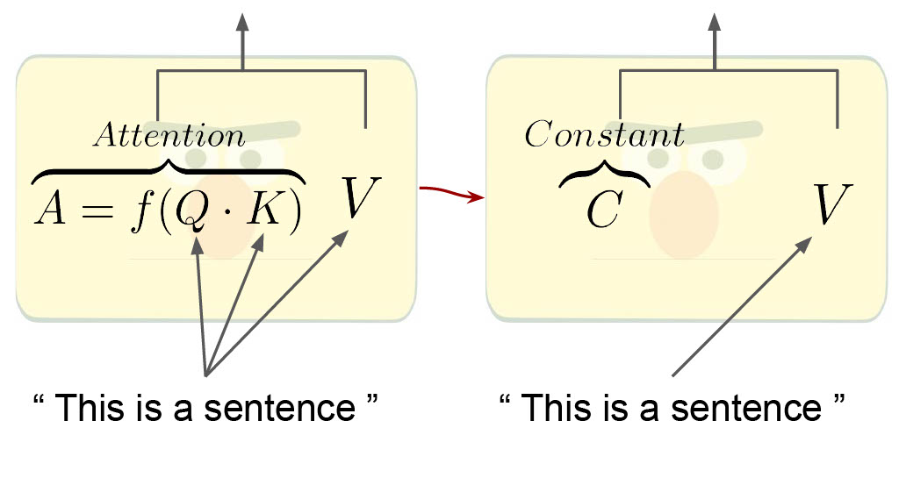

# PAPA
This repository contains the code for our our Findings of EMNLP 2022 paper: How Much Does Attention Actually Attend? Questioning the Importance of Attention in Pretrained Transformers by Michael Hassid, Hao Peng, Daniel Rotem, Jungo Kasai, Ivan Montero, Noah A. Smith and Roy Schwartz.

<p align="center">
  
</p>

## Citation:
```
@inproceedingsi{Hassid:2022,
        author = {Michael Hassid and Hao Peng and Daniel Rotem and Jungo Kasai and Ivan Montero and Noah A. Smith and Roy Schwartz},
        title = {How Much Does Attention Actually Attend? Questioning the Importance of Attention in Pretrained Transformers},
	booktitle = {In Findings of EMNLP},
        year = {2022}
}
```

## How to use

Our code is based on the [Hugging Face](https://github.com/huggingface) framework (specificlly on the transformers library).
To use our code please first follow the instrunctions in [here](https://huggingface.co/docs/transformers/installation#editable-install).

Once evrything is set, copy our [transformers/](https://github.com/schwartz-lab-NLP/papa/tree/main/transformers
) directory to the original transformers directory (this will add some scripts and required capablities).

As an example we will provide the full command lines in order to run PAPA over [BERT BASE](https://huggingface.co/bert-base-uncased) with the [CoLA](https://nyu-mll.github.io/CoLA/) task:

First navigate to the papa_scripts directory:
```bash
cd transformers/papa_scripts
```

To extract the constant matrices, run:
```bash
MODEL=bert-base-uncased
TASK=COLA

python3 run_papa_glue_avgs_creator.py --model_name_or_path ${MODEL}  --task_name ${TASK}  --max_length 64    --per_device_train_batch_size 8   --output_dir <dir_to_save_constant_matrices> --cache_dir <your_cache_dir> --use_papa_preprocess true  --pad_to_max_length
```
For extracting the heads sorting, run:

```bash
MODEL=bert-base-uncased
TASK=COLA

python3 run_papa_glue.py --model_name_or_path ${MODEL} --task_name ${TASK} --do_eval --max_seq_length 64 --per_device_train_batch_size 16 --per_device_eval_batch_size 16 --output_dir <dir_to_save_sorted_heads> --cache_dir <your_cache_dir>  --do_train --num_train_epochs 15.0 --learning_rate 2e-5 --lr_scheduler_type constant --disable_tqdm true --evaluation_strategy epoch --save_strategy no --use_papa_preprocess --use_freeze_extract_pooler true --static_heads_dir <dir_saves_constant_matrices>  --save_total_limit 0 --sort_calculating True
```
Now, to perform and get the full PAPA method results, run:

```bash
MODEL=bert-base-uncased
TASK=COLA

for static_heads_num in 0 72 126 135 144
 do
python3 run_papa_glue.py --model_name_or_path ${MODEL} --task_name ${TASK} --do_eval --max_seq_length 64 --per_device_train_batch_size 16 --per_device_eval_batch_size 16 --output_dir <dir_to_save_results> --cache_dir <your_cache_dir> --do_train --num_train_epochs 15.0 --learning_rate 2e-5 --lr_scheduler_type constant --disable_tqdm true --evaluation_strategy epoch --save_strategy no --use_papa_preprocess --grad_for_classifier_only true --use_freeze_extract_pooler true --static_heads_dir <dir_saves_constant_matrices> --static_heads_num ${static_heads_num} --save_total_limit 0 --sorting_heads_dir <dir_saved_sorted_heads>
done
```

To perform the same analysis with token-classification tasks use the scripts [run_papa_ner.py](https://github.com/schwartz-lab-NLP/papa/blob/main/transformers/papa_scripts/run_papa_ner.py) instead of [run_papa_glue.py](https://github.com/schwartz-lab-NLP/papa/blob/main/transformers/papa_scripts/run_papa_glue.py) and [run_papa_ner_avgs_creator.py](https://github.com/schwartz-lab-NLP/papa/blob/main/transformers/papa_scripts/run_papa_ner_avgs_creator.py) instead of [run_papa_glue_avgs_creator.py](https://github.com/schwartz-lab-NLP/papa/blob/main/transformers/papa_scripts/run_papa_glue_avgs_creator.py).
